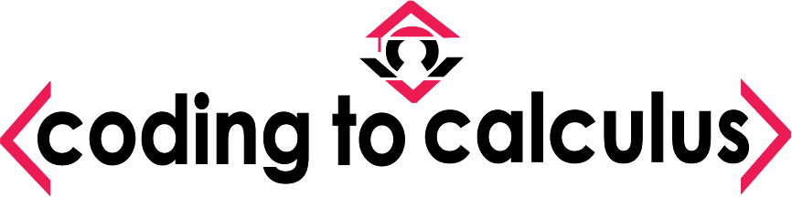

## Coding to Calculus

# Goals and Motivation
Coding to Calculus started out as an offshoot of the [Bridge to Calculus](https://cos.northeastern.edu/mathematics/about/outreach/bridge-to-calculus/) outreach program run out of Northeastern University. Bridge to Calculus is a partnership with the Boston public school system that aims to prepare motivated students for AP level calculus courses (AB/BC).  The primary goal of this course project is to present python in a mathematical light, and to help students better understand high school level maths, while also helping them create personal projects that will lead to stronger college applications.

# Structure and Lectures
## Structure
The course is broken up into a series of lectures that are designed to be presented using Jupyter notebook and reveal.js. The ultimate goal is to have an accompanying  blog post/live presentation to supplement the more complex lectures and topics. Topics from calculus  are introduced, but the main purpose of this course is to strenghten a student's background and understanding of Geometry and Algebra.

# Lecture Slides

[comment]:LECTURE_SLIDES

## [Lecture 1:](/Lecture_slides/Lecture_1_intro.slides.html) 
## [Lecture 2:](/Lecture_slides/Lecture_2.slides.html) 

[comment]:LECTURE_SLIDES

# Lecture Jupyter Notebooks 
# [Lecture 1:](Lectures_code/Lecture_1_intro.ipynb)
- This lecture introduces the course, and helps students write their first program (obligitory ``"Hello World!"``)

# [Lecture 2:](Lectures_code/Lecture_2.ipynb)
- This lecture introduces students to basic arithmetic in python and uses several built in datatypes as a motivating example. It also briefly introduces the rules of algebra in the context of Python.

## Logo Design
[Rachel Bakish](http://bakishdesigns.com/)
